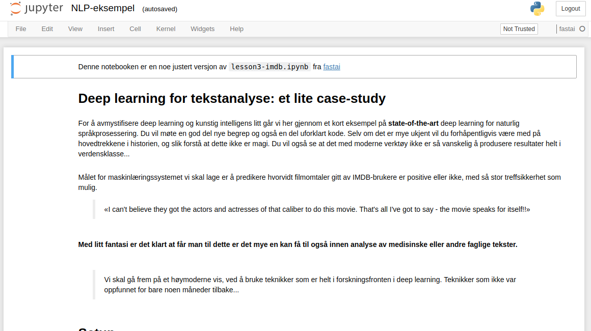

# HELIKT620-KI-2019
Materiale fra forelesning om kunstig intelligens i HELIKT620, januar 2019.

[Alexander S. Lundervold](http://alexander.lundervold.com), [HVL](https://www.hvl.no/person/?user=3610493) & [MMIV](https://mmiv.no/).

# Presentasjon

# Kode fra hands-on-eksempel
Notebooken vi brukte var [`NLP-eksempel.ipynb`](NLP-eksempel.ipynb).

# Anbefalt litteratur

## Generelle referanser
* On the Prospects for a (Deep) Learning Health Care System, C. David Naylor, JAMA 2018, https://jamanetwork.com/journals/jama/fullarticle/2701667 
* Deep Learning—A Technology With the Potential to Transform Health Care, G. Hinton, JAMA 2018, https://jamanetwork.com/journals/jama/fullarticle/2701666 
* High-performance medicine: the convergence of human and artificial intelligence, E. Topol, Nature Medicine 2019, https://www.nature.com/articles/s41591-018-0300-7 

## For spesielt interesserte
* Scalable and accurate deep learning with electronic health record, A. Rajkomar, [...], J. Dean, Nature Digital Medicine 2018, https://www.nature.com/articles/s41746-018-0029-1
* An overview of deep learning in medical imaging focusing on MRI, A. S. Lundervold and A. Lundervold, Zeitschrift für Medizinische Physik, 2018, https://www.sciencedirect.com/science/article/pii/S0939388918301181
